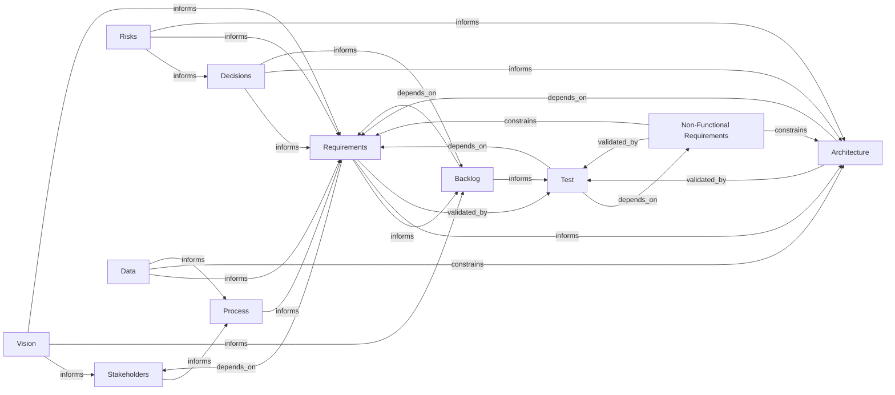

# Context Blocks Relationship Diagram Concept

This diagram visualizes all defined Context Blocks, their relationships to each other, and the main information flow between them.

## Block Types

The diagram includes the following context block types:

**Core Discovery Flow:**
- Vision
- Stakeholders
- Process
- Requirements
- Backlog
- Test

**Cross-cutting Blocks:**
- Risks
- Decisions
- Non-Functional Requirements (NFR)
- Data
- Architecture

## Relationship Types

The diagram uses these relationship types:
- **informs** → Provides input or information to another block
- **depends_on** → Requires or derives from another block
- **validated_by** → Quality/correctness is verified by another block
- **constrains** → Imposes limitations or boundaries on another block

**Note:** This diagram represents a conceptual view of relationships. The current BA Context Block Schema (v1.0) implements `informs` and `dependsOn` (along with `conflictsWith`). The `validated_by` and `constrains` relationships shown here represent logical relationships that help analysts understand the complete picture of how blocks interact.

## Diagram

## Key Insights

### Main Discovery Flow
The primary flow follows a logical progression from high-level vision to concrete testing:
1. **Vision** establishes the strategic direction
2. **Stakeholders** identify who is involved and affected
3. **Process** defines how work gets done
4. **Requirements** specify what needs to be built
5. **Backlog** prioritizes and sequences the work
6. **Test** validates the implementation

### Cross-cutting Concerns

**Non-Functional Requirements (NFR)**
- Constrains both Requirements and Architecture
- Must be validated through Testing

**Data**
- Informs Process and Requirements
- Constrains Architecture design choices

**Architecture**
- Depends on Requirements
- Must be validated through Testing
- Influenced by Decisions and Risks

**Risks**
- Informs Decisions, Requirements, and Architecture
- Helps teams make informed trade-offs

**Decisions**
- Captures important choices that shape Requirements, Architecture, and Backlog
- Informed by Risks

## Usage

This diagram helps Business Analysts and stakeholders:
- Understand which blocks exist in the requirements engineering process
- See how blocks depend on each other
- Identify which blocks inform or validate others
- Plan the sequence of deliverable creation
- Ensure complete traceability across artifacts
